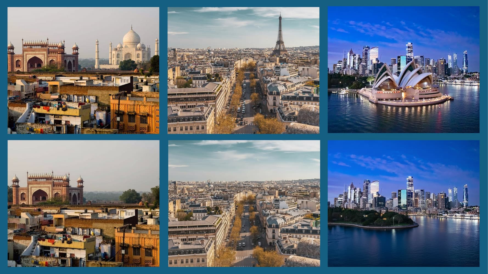
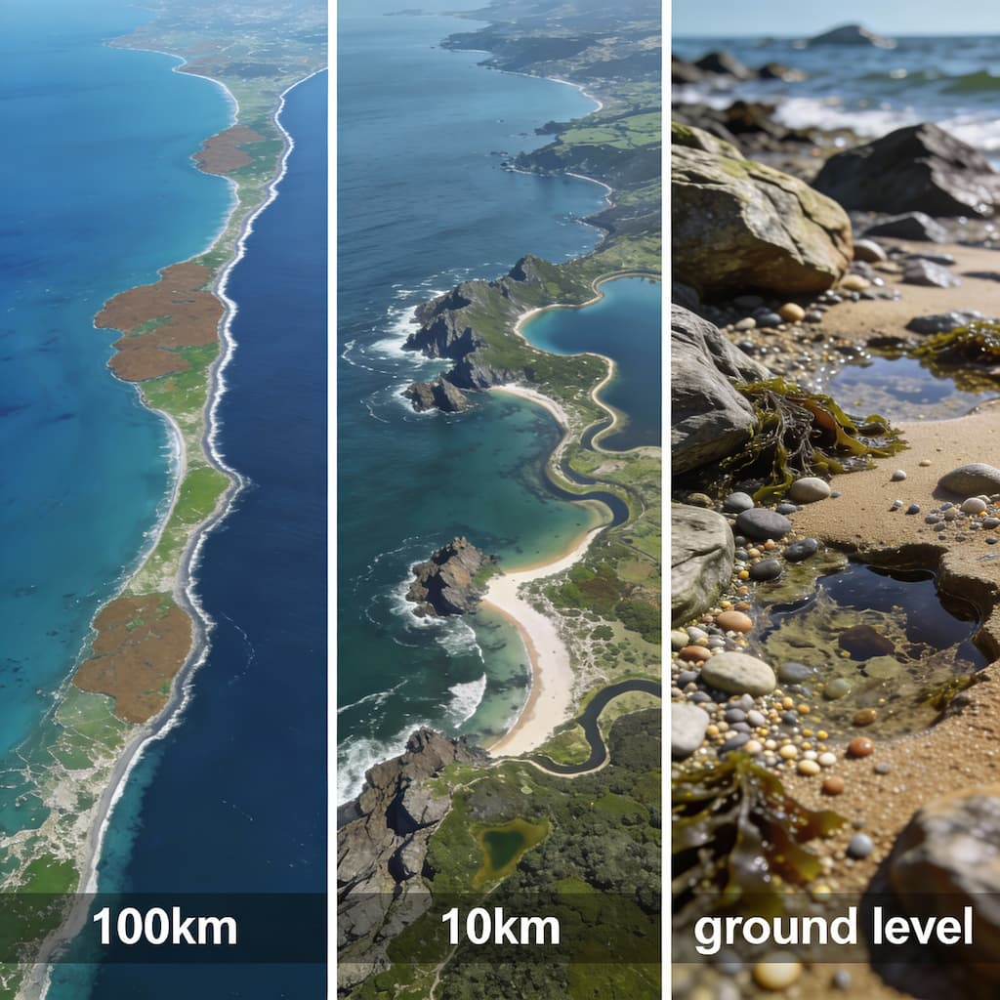

I am here to share with you six lessons about innovation and entrepreneurship. Not in the usual way though. These are visual, memorable, and if I've done my job right, they'll stick with you long after you've finished reading.

## Simplicity is Ultimate Sophistication

Look at Picasso's bulls. Not just one bull, but eleven of them, each simpler than the one before. Watch as the great artist strips away detail, removes everything unnecessary, until only the essential lines remain. It is still recognisably a bull, but almost everything else is gone.

This is not a child's sketch. This is Picasso, who called himself the greatest artist of modern times, deliberately removing detail until he reached the point where one more stroke less would mean it stops being a bull.

Apple embraced this idea, popularising the line "Simplicity is the ultimate sophistication." Closer to home, think of Gandhi. His essence could be captured in just a few strokes—a curve, a circle, another curve—and still we immediately see him. His own words were "My life is my message".

This principle applies to products too. Think of the remote controls at home with 17 or 25 buttons, when most of us only use power, volume and channel. The rest? Rarely touched, barely understood, because technology makes it easy to add complexity.

Now look at the Apple TV remote. Just three main controls—play, pause and a volume dial—designed around what people actually use. The message? **Keep things simple. Because simplicity is the ultimate sophistication.**

## Be Different, Not Uniform

Can you recognise a city just from a generic skyline? If the iconic parts are hidden, it becomes very hard to identify. But if one landmark is revealed, suddenly everyone knows.

A random skyline might look like Delhi or almost any big city, but once the Eiffel Tower appears, you instantly know it is Paris. Similarly, the Sydney skyline becomes unmistakable once you see the Opera House. The point? If you are designing "just another building" that blends in, you gain no recognition, no innovation credit and no entrepreneurial edge.

It is easy to be like a string of identical shining pearls, all polished, all similar, but none truly unique. In contrast, look at grains of sand under an electron microscope. Every grain is different in shape and texture, just like every person is special, even though from a distance they may seem uniform.

So the message is this: **be special, think different.** All the obvious ideas have already been taken—Newton has done gravity, Einstein has done relativity. The question is what unique element you can add, what difference you can bring.

## Help Others, Make Yourself Useful

Here is an interesting research project. A friend studied 2,000 obituaries in The New York Times over 20 months. Not paid family notices, but editorial obituaries written by journalists about notable people.

Each obituary has a headline that gives the essence of the person. Something like "Lee Kuan Yew, founding father and first prime minister of Singapore, dies at 91." Remove the name and age, and you are left with an essence statement: "Founding father and first prime minister of Singapore."

He collected about 2,000 such essence sentences and fed them into a machine-learning system to see which words showed up most often. The result? Roles like singer, leader, director, artist, engineer appeared, but the recurring themes that really stood out were about helping, serving and contributing to others and to society.

He then compared those 2,000 "famous" obituaries with 2,000 more "not-so-famous" ones. People who may not be global celebrities but who planted a thousand trees in their town, or worked tirelessly for communities, or did important local work that never made headlines. Even there, the repeated pattern was the same: helping others, being useful to society, giving something of value beyond oneself.

So the message is this: nobody can promise to solve all your problems, but **you can promise that the people around you will not have to face theirs alone.** Before chasing "big innovation" and "entrepreneurship," start by asking: **will this help someone, will this be of use to others.** If you begin there, you will already reach a very high standard of success.

## Open Your Mind

When people started localizing traditional Latin back in 64 AD, a new language was born. It was critized, discriminated and even punished back then. Had people stuck to the text book standards of Traditional Latin, we wouldnt have given birth to the most romantic language French today.

So what is real learning then? Imagine a bag of balloons with no air in them, and one balloon that has been inflated, held for years and then slowly deflated. The second balloon has stretched and its capacity has increased, while the others have never been exercised.

We often ask: why do we study "useless" things in college that we may never use directly in life? The answer is that the purpose is to expose you to something very different, odd and challenging so that your mind expands. When you later meet new ideas and new people in the real world, your mind has the capacity to absorb them because it has already been stretched.

The goal of education is not to stuff your head with content but to increase its holding capacity. **To replace an empty mind not just with a filled one but with an open one.** So the message is: **open your mind.**

## Learn by Doing

From your school days, which skills do you truly remember and still use? Very few people will say, "I love doing integration so much I would skip lunch to do it," or "Balancing chemical equations is my favourite pastime".

But many people will say, "I learned how to ride a bicycle, and I still can ride it without consciously thinking about balance, brakes and posture," even if they have not touched a cycle for 25 years while driving scooters and cars.

Nobody learned cycling from a textbook chapter titled "How to ride a bicycle" with neat instructions and step-by-step diagrams. Instead, someone said "Don't be scared, I will hold you," took you outside, ran alongside you, and at some point quietly let go. And you discovered that you were riding on your own.

The point is: **we learn what we have to learn by doing it, not just by thinking or reading about it.** Recently, at events like the Smart India Hackathon, students were collaborating, experimenting, building and learning in exactly this way, with a level of joy and energy that is very different from studying only to score more marks than the person next to you in an exam.

So the message is: **learn by doing. Get out of the classroom, build, test, break, fix and experience.**

## Stand on Shoulders, Zoom In

Many people feel that everything has already been invented, every problem has a startup, and wonder what is left for them to do. But this is where "zooming in" becomes important.

Consider a simple question: what is the length of the Indian coastline, from Gujarat all the way around to West Bengal? Using Google's satellite data with a scale bar on the map, you might estimate it as about 7,500 kilometres. That looks like a precise answer, but the real answer depends entirely on your "measuring rod".

If you measure from an aeroplane at high altitude, coastline details look like smooth curves and you might say 7,500 km. If you fly lower and trace more inlets and curves, the length could be 10,000 or 15,000 km. If you walk every small bay, rock and inlet, it could be 40,000 km or more. And for an ant walking into every tiny crevice, the distance could reach hundreds of thousands or millions of kilometres in effective path length.

Now imagine an ant walking that same coastline. For the ant, every pebble becomes a mountain to climb over, every crack becomes a canyon to navigate around, every grain of sand adds distance to the journey. What looked like a smooth curve from the aeroplane is now an endless maze of opportunities and obstacles. The ant's effective walking distance could reach hundreds of thousands, even millions of kilometres, because at that scale, entirely new details emerge that were invisible from above.
The smaller your measuring rod, the longer the coastline appears, and the length does not converge to a single fixed value. It can grow arbitrarily large, as shown by examples like the highly indented Alaskan coastline where sailing "along the edge" takes far longer than the straight-line distance suggests.

This is the science of fractals and chaos: the closer you look, the more structure you see. Entrepreneurship is similar. Tesla did not "finish" the electric-car problem. There is still room to innovate in how cars are charged, how energy is stored, how systems are integrated.

Email seemed "done" 40 years ago, yet new email systems and innovations keep appearing because someone always zooms into a specific nook or niche and says, **There is a gap here; nobody is solving this part; let me explore it**.

All the land on Earth has been discovered, and even the Moon has been mapped and photographed, so you may not find brand-new land. But entrepreneurship lies in asking what new things you can do with the land that already exists.

So the final message is: **keep zooming in, keep looking for the unnoticed gaps between what already exists, and build on what others have done instead of assuming everything is finished.**

## Conclusion
Strip away the unnecessary, stand out from the uniform, and ask if what you build serves others. Keep your mind open through learning by doing, and remember: the closer you look, the more opportunities you will find. Innovation is not about inventing something entirely new—it is about zooming into the gaps that everyone else walked past.
